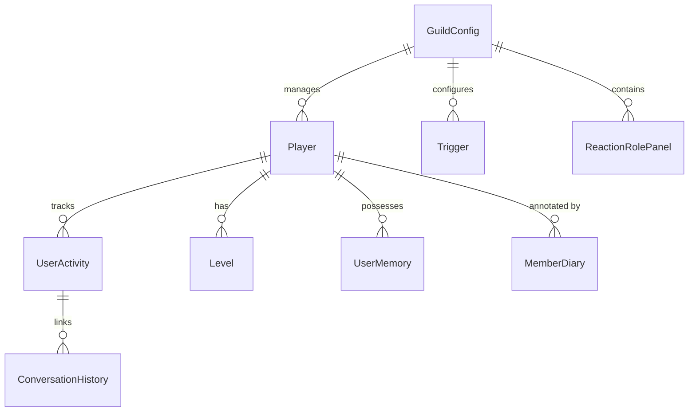
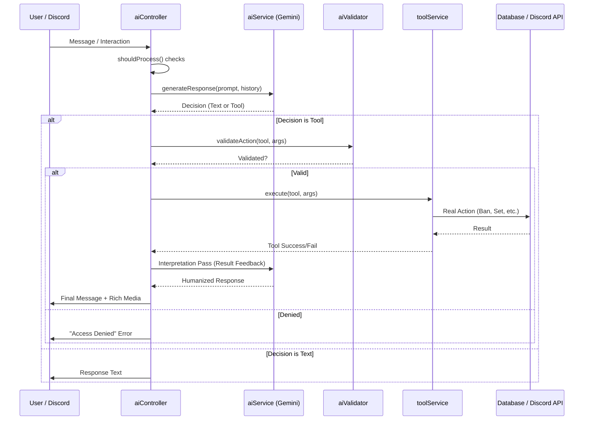
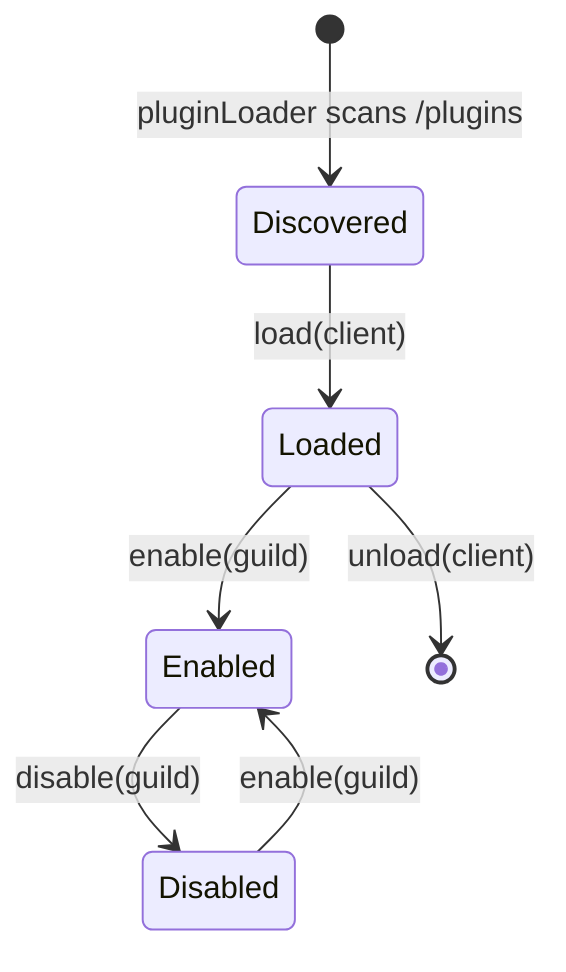

# JACK SYSTEM BLUEPRINT v1.0.0
# The Bone Marrow Document — Master Architectural Reference

> **PURPOSE:** This is Jack's single source of truth for the entire codebase.
> Before writing or patching ANY code, Jack reads this file first.
> This eliminates the need to scan files just to understand the architecture.
> Maintained in root. Propose updates via `propose_code_change`. Never auto-apply.

---

## 0. DOCUMENTATION PHILOSOPHY

Jack's documentation is split into two specialized layers:

1.  **The Blueprint (THIS FILE)**: The technical source of truth for the *engine*. If you are changing how the bot works, read/update this.
2.  **The Vault (`/Jack_Vault`)**: The operational knowledge base for *features*. If you are explaining how to use a plugin or managing the clan, update the Vault.

> **RULE:** Never let the code and documentation drift. Use `npm run docs` to keep command lists synced.

---

## 1. DIRECTORY MAP

```
Jack/                               ← Project root
├── main.js                         ← Entry point (boots bot + PM2 process)
├── JACK_BLUEPRINT.md               ← THIS FILE — read before any coding task
├── .env                            ← Secrets: DISCORD_TOKEN, GOOGLE_API_KEYS, OWNER_IDS, MONGO_URI
├── core/                           ← Brain layer — AI, loaders, validators
│   ├── aiController.js             ← Routes messages → AI → tools → responses
│   ├── aiValidator.js              ← Permission gate before tool execution
│   ├── personalityEngine.js        ← Builds Jack's tone/humor/strictness per user
│   ├── memoryEngine.js             ← Semantic memory read/write (vector search)
│   ├── embeddingService.js         ← Gemini embedding-001 vector generator
│   ├── taskEngine.js               ← Background job runner with auto-notify
│   ├── pluginLoader.js             ← Loads all 36 plugins dynamically
│   ├── commandLoader.js            ← Registers 108 slash commands with Discord
│   ├── eventLoader.js              ← Loads Discord event handlers
│   ├── observer.js                 ← Records AI action success/failure history
│   ├── commandExecutor.js          ← Unified command execution with cooldowns
│   ├── cooldownManager.js          ← Per-user and per-guild cooldown enforcement
│   ├── serverMapManager.js         ← Builds server channel/role maps
│   ├── DEV_RULES.md                ← Coding standards — MUST follow
│   ├── memory/
│   │   └── userProfile.js          ← Per-user profile cache
│   └── tools/                      ← Jack's 29 self-abilities (one file per tool)
│       ├── ban-member.js
│       ├── kick-member.js
│       ├── timeout-member.js
│       ├── untimeout-member.js
│       ├── warn-member.js
│       ├── purge-messages.js
│       ├── moderate-voice.js
│       ├── assign-role.js
│       ├── remove-role.js
│       ├── announce-message.js
│       ├── get-server-stats.js
│       ├── get-server-map.js
│       ├── get-system-map.js
│       ├── get-user-roles.js
│       ├── get-player-profile.js
│       ├── get-clan-leaderboard.js
│       ├── get-optimal-matchmaking.js
│       ├── record-personality-trait.js
│       ├── update-stats.js
│       ├── register-player.js
│       ├── search-database.js
│       ├── read-codebase-file.js   ← Jack reads source files
│       ├── list-directory.js       ← Jack navigates folders
│       ├── propose-code-change.js  ← Jack drafts a patch (saves to /proposals/)
│       ├── apply-code-change.js    ← Jack applies an approved proposal
│       ├── write-system-log.js
│       ├── read-system-logs.js
│       ├── restart-system.js
│       ├── adjust-self-personality.js
│       └── send-proactive-ping.js  ← Jack pings owner proactively
├── bot/
│   ├── index.js                    ← Discord client init + startup sequence
│   ├── database/
│   │   └── models/                 ← 26 Mongoose models (see Section 3)
│   ├── events/
│   │   └── messageCreate.js        ← Entry: routes DMs → processDM, guild msgs → AI/prefix
│   ├── handlers/
│   │   ├── prefixHandler.js        ← Handles j! prefix commands
│   │   ├── afkHandler.js           ← Detects and manages AFK status
│   │   └── screenshotHandler.js    ← Routes game screenshots to visionService
│   ├── interactions/
│   │   └── reactionRoleButtons.js  ← Handles rr_assign_ button interactions
│   └── utils/                      ← 35 utility modules (see Section 4)
├── plugins/                        ← 36 self-contained feature plugins (see Section 5)
├── utils/
│   └── logger.js                   ← ONLY logger to use. Never use console.log()
├── data/                           ← Static JSON data files
├── assets/                         ← Images, GIFs, fonts
└── logs/                           ← Runtime log files
```

---

## 2. PRODUCTION CONSTANTS

> These are the **only** server this bot serves. Treat these as sacred.

| Constant | Value |
|---|---|
| **Guild ID** | `1341978655437619250` |
| **AI Sandbox Channel** | `1488453630184132729` |
| **Bot Token** | `process.env.DISCORD_TOKEN` |
| **Owner IDs** | `process.env.OWNER_IDS` (comma-separated) |
| **Google API Keys** | `process.env.GOOGLE_API_KEYS` (comma-separated, rotated on 429) |
| **MongoDB URI** | `process.env.MONGO_URI` |
| **AI Model** | `gemini-3.1-pro-preview` |
| **Embedding Model** | `gemini-embedding-001` (3072 dimensions) |

---

## 3. DATABASE MODELS — Full Field Reference

### System Entity Relationship



All models live in `bot/database/models/`. Import with `require('../../../bot/database/models/ModelName')`.

---

### `GuildConfig` — Server Configuration (master settings document)
```
guildId            String (unique, indexed)
prefix             String (default: "j")

greetingData:
  welcomeEnabled       Boolean
  welcomeChannelId     String
  welcomeMessage       String
  welcomeImage         String
  goodbyeEnabled       Boolean
  goodbyeChannelId     String
  goodbyeMessage       String
  goodbyeImage         String

moderation:
  antiLink             Boolean
  antiSpam             Boolean
  blacklistedWords     [String]
  maxMentions          Number (default: 5)
  muteRoleId           String

plugins:              { pluginName: Boolean }  ← toggle per plugin

settings:
  -- LOG CHANNELS --
  logChannelId, voiceLogChannelId, modLogChannelId, inviteLogChannelId,
  marketLogChannelId, messageLogChannelId, joinLeaveLogChannelId,
  memberLogChannelId, serverLogChannelId, ticketsLogChannelId, popLogChannelId

  -- FEATURE CHANNELS --
  classificationChannelId, fosterChannelId, countingChannelId,
  cardExchangeChannelId, marketChannelId, clanBattleChannelId,
  synergyChannelId, intraAnnounceChannelId, cardDatabaseChannelId,
  tempvcCreateChannelId, tempvcPanelChannelId, tempvcCategoryId,
  teamupChannelId, generalChannelId, mediaChannelId, linksChannelId,
  botCommandsChannelId, aiChannelId, registrationChannelId,
  xpIgnoreChannels [String], dealCategoryId

  -- FEATURE ROLES --
  clanMemberRoleId, newbieRoleId, discordMemberRoleId, ownerRoleId,
  managerRoleId, adminRoleId, contributorRoleId, mentorRoleId,
  rookieRoleId, synergyRoleId, traderRoleId, marketRoleId,
  weeklyMvpRoleId, seasonWinnerRoleId, intraParticipateRoleId,
  intraWinnerRoleId, clanBattleWinnerRoleId, teamupRoleId

  -- AI CONTROLLER --
  aiEnabled            Boolean (default: true)

  -- PERSONALITY ENGINE v2 --
  personality: { tone, humor(0-100), strictness(0-100), verbosity(0-100), respect_bias(0-100) }

  -- LEVEL ROLES MAP --
  levelRoles           Map<level:String, roleId:String>
```

---

### `Player` — Clan Member Registry
```
discordId          String (unique, sparse)
serialNumber       String (unique, sparse, indexed)  ← Format: "JK-XXXX"
status             String enum: ["linked", "unlinked"]
createdBy          String
isManual           Boolean
role               String enum: ["owner","manager","admin","contributor","none"]
isDeleted          Boolean
isClanMember       Boolean
registered         Boolean
discordName        String
username           String
avatar             String
ign                String (in-game name, indexed)
uid                String (game UID, indexed)
accountLevel       String
preferredModes     [String]
clanJoinDate       Date
lastSeasonSynergy  Number
seasonSynergy      Number
weeklySynergy      Number
lastWeeklySubmission String
achievements:
  intraWins, clanBattleWins, bestClanBattleRank,
  fosterWins, fosterParticipation, weeklyMVPCount, highestSeasonRank
screenshot         String (URL)
```

---

### `UserMemory` — Jack's Semantic Memory
```
userId       String (required)
guildId      String (required)
type         String enum: ["event", "behavior", "preference"]
content      String (the memory text)
tags         [String]
importance   Number 0.0–1.0 (default: 0.5)
embedding    [Number] (3072-dim vector, auto-generated by memoryEngine)
createdAt    Date
```
> Auto-expires: No. Queried via vector similarity by `memoryEngine.getRelevantMemory()`.

---

### `MemberDiary` — Jack's Private Notes on Members
```
discordId          String (unique)
nickname           String
personalityProfile String  ← AI-written personality analysis
reputationScore    Number  ← -100 (Toxic) to +100 (Loyal)
loyaltyStatus      String  (e.g. "Loyal", "Neutral", "Hostile")
lastInteraction    Date
interactionCount   Number
notes              String  ← Jack's private notes
nicknameByJack     String  ← e.g. "The Sniper", "The Troll"
```

---

### `ConversationHistory` — AI Chat Memory (per user)
```
channelId  String (indexed) ← Actually stores userId, not channelId (legacy naming)
messages   [{ role: "user"|"model", content: String, timestamp: Date }]
lastActive Date
```
> Auto-expires after 7 days of inactivity. Max 20 messages kept (oldest pruned).

---

### `UserActivity` — Behavioral Signals
```
discordId        String (unique)
messageCount     Number
lastActive       Date
activityScore    Number
joinDate         Date
leaveDate        Date
successfulActions Number  ← AI tool calls that succeeded
failedActions     Number  ← AI tool calls that failed
lastActionType    String
aiCallsToday      Number  ← Daily AI limit counter
aiCallsDate       String  ← 'YYYY-MM-DD' — resets on new day
```
> Daily AI limit per non-owner user: **50 calls/day** (defined in `aiService.js`).

---

### `Level` — XP & Leveling
```
userId       String
guildId      String
xp           Number (total XP)
weeklyXp     Number (resets weekly)
level        Number
background   String (custom rank card background URL)
lastMessage  Date
```

---

### `Warn` — Moderation Warnings
```
userId       String
guildId      String
moderatorId  String
reason       String
timestamp    Date
```

---

### `Trigger` — Auto-Response Rules
```
guildId    String
trigger    String
matchType  String enum: ["substring","strict","startswith","endswith","exact","regex"]
response   String
actions:   { addRoles[String], removeRoles[String], deleteTriggeringMessage, dmResponse }
filters:   { allowedChannels[String], ignoredChannels[String], allowedRoles[String], ignoredRoles[String] }
enabled    Boolean
```

---

### Other Models (quick reference)
| Model | Key Fields |
|---|---|
| `Card` | cardId, name, rarity, type, imageUrl, packId, description |
| `CardExchange` | panelMessageId, channelId, listings[] |
| `EmojiBank` | guildId, emojis[{emojiId, name, url, packId}] |
| `EmojiPack` | packId, name, emojis[], price |
| `InviteStats` | guildId, userId, code, uses, invitedUsers[] |
| `InviteJoin` | guildId, userId, inviterId, code, joinedAt |
| `ReactionRolePanel` | panelID, messageId, channelId, guildId, roles[{roleId, label, emoji}] |
| `StickerBank` | guildId, stickers[{stickerId, name, url}] |
| `CommandUsage` | commandName, guildId, userId, usedAt |
| `ActivityLog` | guildId, userId, action, details, timestamp |
| `Afk` | userId, guildId, reason, timestamp |

---

## 4. CORE SERVICES API

### AI Processing Pipeline



### `bot/utils/configManager.js`
```js
const configManager = require('./configManager');

// Get full GuildConfig document for a server
const config = await configManager.getGuildConfig(guildId);
// Returns: full GuildConfig doc or creates default if missing

// Update a specific setting
await configManager.updateSetting(guildId, 'settings.aiChannelId', channelId);
```
> **Always use configManager** to read/write guild settings. Never query GuildConfig directly in plugins.

---

### `utils/logger.js`
```js
const logger = require('../../utils/logger');  // adjust path to root

logger.info("TagName", "Your message");
logger.warn("TagName", "Warning message");
logger.error("TagName", "Error message");
```
> **NEVER use `console.log()`**. Always use logger. This rule is absolute.

---

### `bot/utils/toolService.js`
```js
const toolService = require('./toolService');

// Get all 29 tool schemas (for AI function declarations)
const schemas = toolService.getToolsSchema();  // returns Array

// Call a specific tool by name
const result = await toolService[toolName](args, member, guild);
// result = { success: Boolean, message: String, data?: any }

// Note: args._client is automatically injected for tools that need Discord access
```

---

### `bot/utils/visionService.js`
```js
const visionService = require('./visionService');

// Extract synergy points from a BGMI stats screenshot
const points = await visionService.extractSynergyPoints(imageUrl);  // returns Number

// Extract clan battle data from a screenshot
const rows = await visionService.extractClanBattleData(imageUrl);   // returns Array

// Extract leaderboard data from a screenshot  
const leaderboard = await visionService.extractLeaderboardData(imageUrl); // returns Array
```

---

### `bot/utils/aiService.js`
```js
const aiService = require('./aiService');

// Generate a response from Jack's AI
const decision = await aiService.generateResponse(
  prompt,         // String
  history,        // Array of {role, content}
  onToken,        // callback or null
  extraContext,   // String — injected into system prompt
  guild,          // Guild object or null (null = DM mode)
  invoker,        // Member object
  imageUrl,       // String or null
  reputationScore,// Number
  activityData,   // UserActivity document
  isOwner         // Boolean
);
// Returns: { type: 'response'|'tool', text, tool?, args?, model }
```

---

### `core/memoryEngine.js`
```js
// Read relevant memories for context (called automatically by aiService)
const memories = await memoryEngine.getRelevantMemory(userId, guildId, prompt);

// Store a new memory
await memoryEngine.storeMemory(userId, guildId, type, content, tags, importance);
// type = "event" | "behavior" | "preference"
// importance = 0.0 to 1.0
```

---

### `core/taskEngine.js`
```js
const taskEngine = require('./taskEngine');

// Submit a background job (fire-and-forget)
const taskId = taskEngine.submit({
  name: 'Human-readable task name',
  fn: async () => {
    // ... do work ...
    return 'Summary of what was done'; // sent to channel on completion
  },
  channelId: '1488453630184132729',
  client,
  ownerId: 'optional-owner-id-for-DM-on-failure'
});
```

---

### `bot/utils/permissionUtils.js`
```js
const perms = require('./permissionUtils');

perms.isOwner(member)              // Boolean — is this the bot owner
perms.isOwnerId(userId)            // Boolean — check by ID only
perms.hasFullBypass(member)        // Boolean — owner or staff (bypasses cooldowns)
perms.isModerator(member)          // Boolean
```

---

## 5. PLUGIN ANATOMY

### Plugin Lifecycle



### Standard Plugin Structure
```
plugins/my-plugin/
├── plugin.json          ← REQUIRED manifest
├── index.js             ← REQUIRED if lifecycle needed
├── commands/            ← Slash commands
│   └── mycommand.js
├── events/              ← Discord event listeners
│   └── messageCreate.js
├── handlers/            ← Panel/button/interaction handlers
│   └── panelHandler.js
└── services/            ← Pure business logic (NO Discord objects)
    └── myService.js
```

### `plugin.json` — Required Fields
```json
{
  "id": "my-plugin",
  "name": "My Plugin",
  "version": "1.0.0",
  "main": "index.js"
}
```

### `index.js` — Required Methods
```js
module.exports = {
  async load(client) { /* global setup — runs once on boot */ },
  async unload(client) { /* cleanup on unload */ },
  async enable(guild) { /* per-guild activation */ },
  async disable(guild) { /* per-guild deactivation */ }
};
```

### Command File Template
```js
const { SlashCommandBuilder, PermissionFlagsBits } = require('discord.js');

module.exports = {
  name: 'commandname',
  category: 'Category',
  permissions: [PermissionFlagsBits.ManageGuild],
  cooldown: { user: 5000, guild: 2000 },
  data: new SlashCommandBuilder()
    .setName('commandname')
    .setDescription('Description'),

  async run(ctx) {
    await ctx.defer();
    // ... logic ...
    await ctx.reply('Response');
  }
};
```

### Event File Template
```js
module.exports = {
  name: 'messageCreate',
  async execute(message, client) {
    // Always check guild isolation
    if (message.guild?.id !== '1341978655437619250') return;
    // ... logic ...
  }
};
```

### Service File Template
```js
// PURE LOGIC ONLY — no Discord objects allowed in services
module.exports = {
  async doSomething(userId, guildId, data) {
    const Model = require('../../../bot/database/models/SomeModel');
    // ... database operations only ...
    return result;
  }
};
```

---

## 6. HOW TO ADD A NEW AI TOOL

Jack's tools live in `core/tools/`. Each file = one tool. Auto-loaded by `toolService.js`.

### Tool File Template
```js
// core/tools/my-tool-name.js
const { PermissionFlagsBits } = require('discord.js');
const logger = require('../../utils/logger');

const OWNER_IDS = (process.env.OWNER_IDS || '').split(',').map(id => id.trim());

module.exports = {
  schema: {
    name: 'my_tool_name',               // snake_case — must be unique
    description: 'What this tool does. Start with a category tag like MEMORY:, MODERATION:, SYSTEM:',
    parameters: {
      type: 'OBJECT',
      properties: {
        param1: { type: 'STRING', description: 'What this param is' },
        param2: { type: 'NUMBER', description: 'What this param is' }
      },
      required: ['param1']
    }
  },

  async execute(args, invoker, guild) {
    // invoker = member object (has invoker.id, invoker.user, invoker.roles)
    // guild   = Guild object (null if called from DM mode)
    // args._client = Discord.js Client (auto-injected — use for channel/user fetch)

    // Owner-only guard example:
    if (!OWNER_IDS.includes(invoker.id)) {
      return { success: false, message: 'Unauthorized.' };
    }

    try {
      // ... your logic ...
      logger.info('MyTool', 'Tool executed successfully');
      return { success: true, message: 'Done.', data: { /* optional */ } };
    } catch (e) {
      logger.error('MyTool', `Failed: ${e.message}`);
      return { success: false, message: e.message };
    }
  }
};
```

### After Adding a Tool
The tool is **automatically discovered** by `toolService.js` on next restart. No manual registration needed.
Just run: `git add . && git commit && git push && [VM deploy]`

---

## 7. CODING LAWS (from DEV_RULES.md — condensed)

| Rule | What to do |
|---|---|
| ✅ Logger | `logger.info/warn/error(tag, msg)` — never `console.log()` |
| ✅ Settings | `configManager.getGuildConfig(guildId)` — never query GuildConfig directly |
| ✅ DB writes | Only in service files — never inside `command.run()` directly |
| ✅ Commands | Always use `ctx.reply()` or `ctx.defer()` — never `interaction.reply()` |
| ✅ Services | Pure logic only — no `client`, `message`, `interaction` objects |
| ✅ Isolation | No cross-plugin imports — plugins must be 100% self-contained |
| ✅ Naming | Files: `kebab-case.js` | Models: `PascalCase.js` | Functions: `camelCase` |
| ❌ Never | Hardcode channel/role IDs in plugins — use `configManager` |
| ❌ Never | Use `require()` from other plugins |
| ❌ Never | Define schemas inline — use `bot/database/models/` |

---

## 8. PROPOSAL WORKFLOW (Jack's Self-Coding Protocol)

When Jack wants to modify or create code:

1. **READ FIRST** — Jack calls `read_codebase_file` on relevant files + this blueprint
2. **PROPOSE** — Jack calls `propose_code_change` which saves a patch to `/proposals/`
3. **REPORT** — Jack calls `send_proactive_ping` to notify the owner with the Proposal ID
4. **APPROVAL** — Owner reviews and says "apply [proposalId]"
5. **APPLY** — Jack calls `apply_code_change` with the proposalId
6. **DEPLOY** — Jack calls `restart_system` or owner runs git push + VM pull manually

> The blueprint itself follows the same process. Jack may propose blueprint updates
> but they require owner approval before being merged.

---

*Last Updated: 2026-04-24 | Version: 1.0.0 | Maintained by: ZEN | VICTOR + Antigravity*
