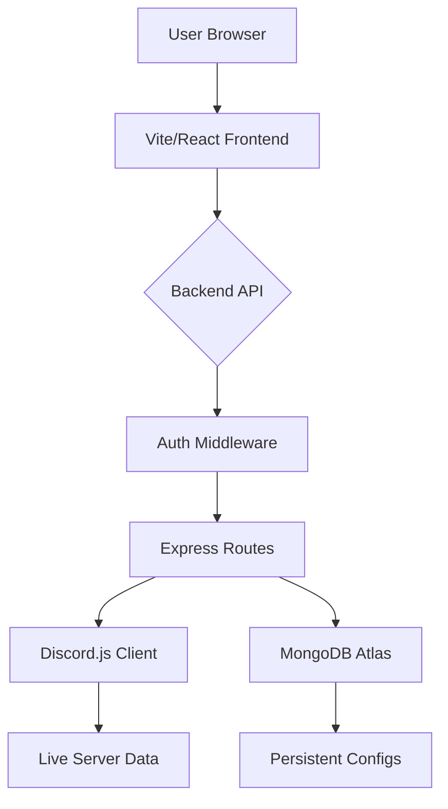

# 🖥️ Dashboard Architecture

The Jack bot features a high-end web control panel built with a **React** frontend and an **Express.js** backend. It allows administrators to manage plugins, clans, and settings through a secure web interface.

## 🎡 System Overview

## 🛠️ Backend (`dashboard/backend/`)
The backend is an Express.js application designed to bridge web requests with the live bot instance.

- **`server.js`**: The main entry point. Initializes the server and mounts routes.
- **Middleware**:
    - `verifyGuildPermission`: Ensures the logged-in user has `Administrator` rights in the requested guild before allowing any changes.
- **Key APIs**:
    - `/api/guilds`: Fetches reachable servers.
    - `/api/clan`: Competitive analytics and management.
    - `/api/foster`: Real-time monitoring of the mentoring program.

## 🎨 Frontend (`dashboard/frontend/`)
A responsive Single Page Application (SPA) built for speed and clarity.

- **Stack**: Vite, React, React-Router, Axios.
- **Key Views**:
    - **Server Overview**: Live stats dashboard (Member count, Active plugins).
    - **Plugin Settings**: Dynamic forms to toggle and configure modules.
    - **Analytics**: Visualization of Synergy points and Clan Battle history.
    - **AIBrain Control**: Tuning the hybrid AI controller's behavioral parameters.

---
**Related Documents:** [[00 - Home]], [[Config-Manager]], [[Player]]
