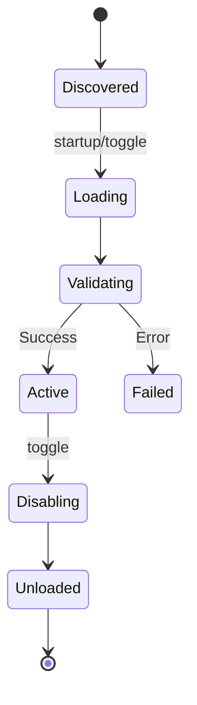

# 🧩 Modular Loading System

Jack Bot is built on a custom plugin architecture that allows for hot-swapping, isolation, and automated health monitoring.

## 📋 The Components

### [[Plugin-Loader]] (`core/pluginLoader.js`)
The orchestrator. It scans the `/plugins` directory and performs:
- **Manifest Validation**: Reads `plugin.json`.
- **Isolation Check**: Ensures plugins don't access restricted core files directly.
- **Lifecycle Management**: Triggers `load()`, `enable()`, `disable()`, and `unload()` hooks.
- **Health Monitoring**: Automatically disables plugins that crash frequently.

### [[Command-Loader]] (`core/commandLoader.js`)
A recursive loader that:
- Scans `plugins/CATEGORY/commands/`.
- Clears the Node.js `require` cache for hot-loading.
- Registers commands into the `client.commands` Map.

### [[Event-Loader]] (`core/eventLoader.js`)
A binder that:
- Scans `plugins/CATEGORY/events/`.
- Binds standard Discord events (e.g., `messageCreate`, `guildMemberAdd`) to handlers.
- Wraps handlers in safety error blocks.

## 🎡 Plugin Lifecycle

---
**Related Documents:** [[00 - Core Architecture]], [[Startup-Sequence]], [[Command-Executor]]
