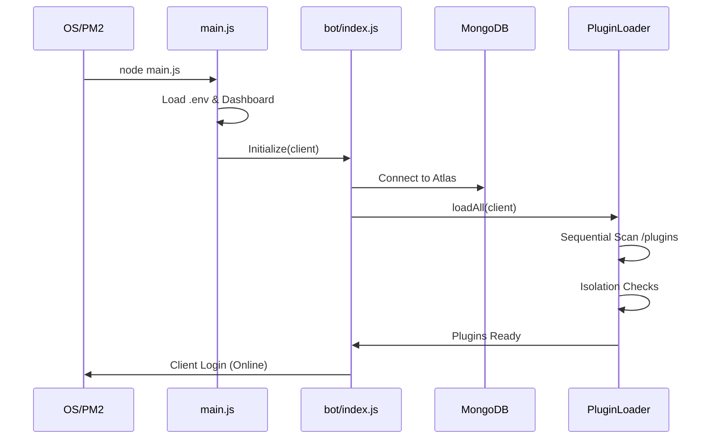

# 🚀 Startup Sequence

The Jack bot uses a multi-stage boot sequence to ensure that all systems, databases, and modular plugins are initialized correctly before the Discord client connects.

## 🕒 The Workflow

## 📂 Stage 1: The Entry Point (`main.js`)
The application entry point is responsible for:
- Initializing the **Environment Variables**.
- Spawning the **Backend API** for the dashboard.
- Handling global process rejections and shutdown signals.

## 📂 Stage 2: Bot Initialization (`bot/index.js`)
This module creates the `Discord.Client` and sets up the primary infrastructure:
- **Database Connection**: Establishes the link to Mongoose.
- **System Bible**: Loads internal constants and strings.
- **Global Handlers**: Mounts the main event listeners.
- **The Call to Loaders**: Triggers the modular loading system.

---
**Related Documents:** [[00 - Core Architecture]], [[Plugin-Loader]], [[Database]]
