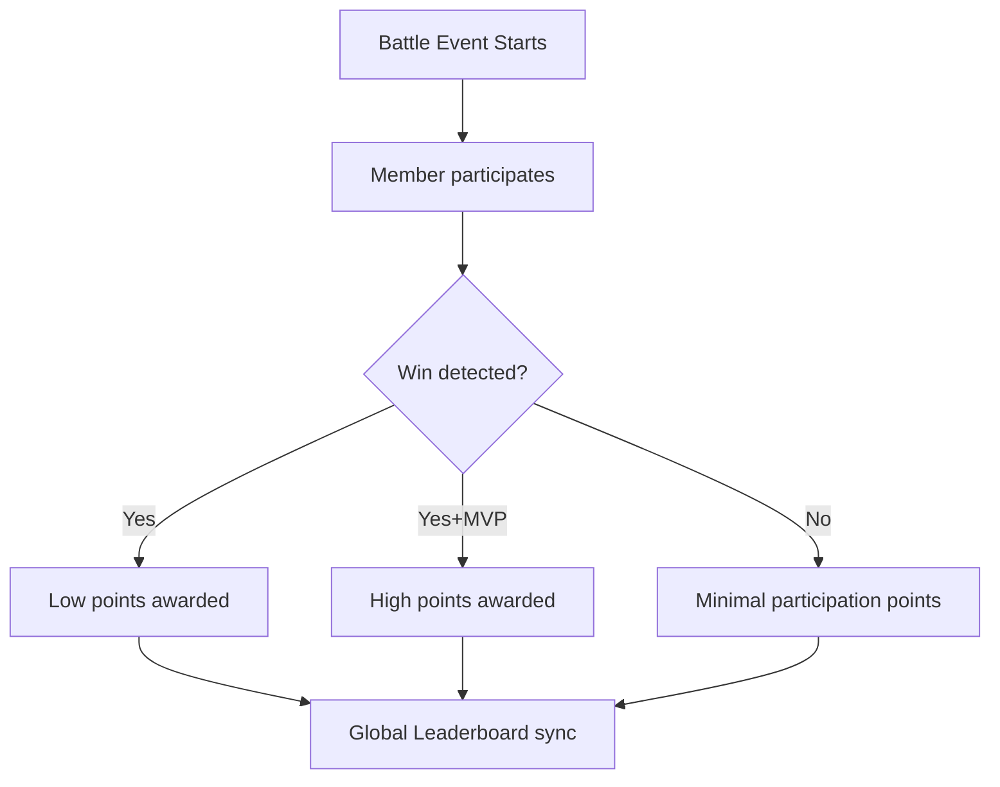

# ⚔️ Clan Battle

The **Clan Battle** system is an automated competitive module that tracks performance, contribution points, and leaderboards for clan-vs-clan warfare.

## 🏆 Scoring Logic

## 📸 Automation & AI Extraction

Clan Battle tracking is now fully automated via the **Automation Panel** in the moderation channel. Staff no longer need to manually input points for each member.

### Workflow:
1. **Initiate**: Click "Collect Screenshots" on the automation panel.
2. **Collect**: Upload screenshots of the in-game **Contribution Point Rankings**.
3. **AI Processing**: Click "Process & Finalize". Jack uses AI to extract:
   - **Today's Points**: Individual daily contribution.
   - **Total Points**: Cumulative battle contribution.
4. **Validation**: If a member's name is not automatically recognized, a manual resolution prompt allows staff to link the data to the correct Discord user.

## 📋 Key Features
- **Auto-Sync**: Links with the `Clans` database to update membership data.
- **Top Performers**: Dynamic leaderboard displayed via visual canvas overlays.
- **Winner Roles**: Automated role distribution for the top-performing clan.
- **AI Ranking**: Zero-manual-entry workflow for large-scale battle data.

## ⚙️ Requirements
- Requires any plugin with the `id: clan` to be enabled.
- Mod channel permissions for the automation panel.

---
**Related Documents:** [[00 - Plugins Index]], [[Intra-Match]], [[Clan]], [[Seasonal-Synergy]]
