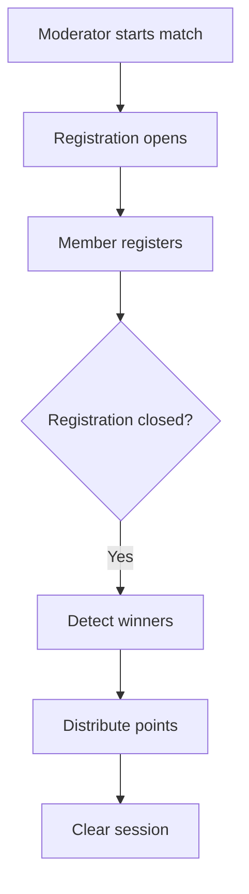

# 🏟️ Intra-Match

The **Intra-Match** system manages automated internal clan tournaments with registration and winner detection.

## 📋 Features

> [!TIP] **Registration Windows**
> Matches have a time-based closing window. Once closed, no further members can join the match roster.

- **Auto-Closing**: Registration closes automatically after X minutes.
- **Winner Detection**: Dynamic detection of the match outcome.
- **Clan Roles**: Assigns specific roles based on participation.

## ⚙️ Logic Flow

---
**Related Documents:** [[00 - Plugins Index]], [[Clan-Battle]], [[Clan]]
