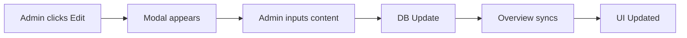

# 🛠️ Server Overview

The **Server Overview** system provides a dual-interface management suite for guild administrators to curate public server information dynamically.

## 📋 Components

> [!SUCCESS] **Public Overview**
> A beautifully formatted, auto-updating message that displays the server's core sections (Socials, Rules, FAQs).

> [!WARNING] **Admin Control Panel**
> A restricted control interface with active buttons to modify the Public Overview content without using any complex commands.

## ⚙️ Logic Map

## 📂 Technical Data
- **Model**: `OverviewConfig.js`
- **Service**: `controlPanelService.js`
- **Command**: `/setup-control-panel`

---
**Related Documents:** [[00 - Plugins Index]], [[Moderation]], [[Admin]]
