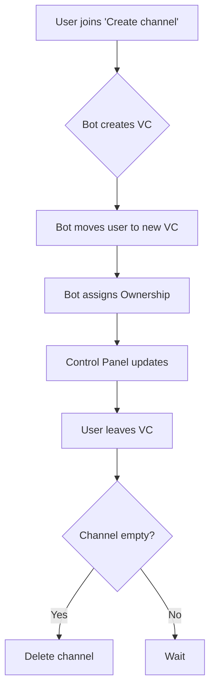

# 🎙️ TempVC

The **TempVC** plugin provides a high-end, dynamic "Join-to-Create" voice channel system. It allows users to own and manage their own private spaces automatically.

## 🎡 Logical Flow

## 📋 Features

> [!INFO] **Dynamic Ownership**
> The first person to join the newly created channel is the "Owner" and gains exclusive rights to the control panel buttons.

- **Lock/Unlock**: Prevents or allows new users to join.
- **Hide/Show**: Toggles "View Channel" permission for `@everyone`.
- **Rename**: Quickly appends a `(Private)` tag to the VC name.

## ⚡ Commands & Controls

| Action | Description | Emoji |
| --- | --- | --- |
| **Lock** | Restrict access to the VC. | 🔒 |
| **Limit** | Cycle between 5 users and Unlimited. | 👥 |
| **Kick** | Remove a member from your voice space. | 👢 |

---
**Related Documents:** [[00 - Plugins Index]], [[Server-Stats]], [[Utility_Commands]]
