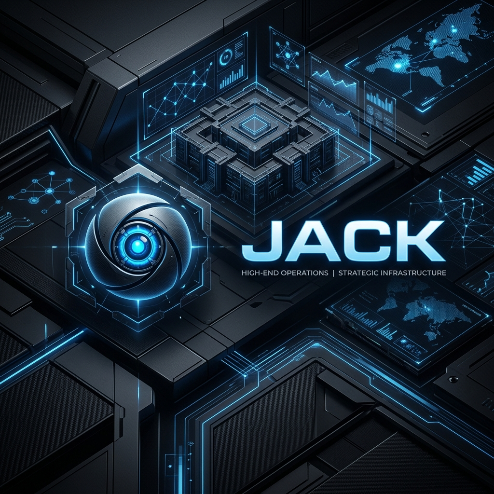

<div align="center">
  <h1>⚙️ JACK: ADVANCDED STRATEGIC OPERATIONS</h1>
  <p><i>The High-End Infrastructure for Elite Communities.</i></p>
  
  <p>
    
    
    
    
  </p>
</div>

---

## 🏛️ ARCHITECTURE & MISSION
**JACK** is a sophisticated, non-nonsense strategic management system engineered for high-performance Discord environments. Built with a focus on stability, precise data management, and operational efficiency, JACK provides the highest level of automated infrastructure for community leaders and elite gaming organizations.

JACK operates as a background core, managing complex community life cycles and competitive gaming frameworks through a unified, high-end plugin architecture.

---

## 🏗️ CORE OPERATIONAL MODULES (PLUGINS)

### 🤝 Strategic Foster Program
A highly optimized mentorship module pairing top-performing **Mentors** with **Neophytes** and **Veterans**.
- **Validated Submissions**: Secure, screenshot-based verification for synergy tracking.
- **Unique Rotations**: Advanced logic ensures diverse engagement cycles every 5 days.
- **Image Generation Engine**: Real-time rendering of pairings and leaderboard data for maximum transparency.

### ⚔️ Competitive Gaming Infrastructure
- **Clan Battle Management**: Comprehensive tracking of competitive matches with automated strategic reporting.
- **Synergy Systems**: Precise tracking of seasonal participation and performance with dynamic leaderboard updates.

### 💎 Economic Systems
- **POP Market**: A high-efficiency marketplace for digital assets featuring optimized Discord embeds and pagination.
- **Collection Management**: Localized card databases and exchange handlers for managing server-specific collectible assets.

### 🛡️ Unified System Governance
- **Audit & Logging**: High-fidelity celestial logging with comprehensive startup reporting and system health monitoring.
- **Channel Optimization**: Hardened management for general, media, and command channels with intelligent filtering.
- **Member Intelligence**: Automated classification and role assignments based on data-driven join patterns and activity.

---

## 🔬 TECHNICAL ENGINE

JACK utilizes a robust infrastructure designed for maximum uptime and scalability:

- **Core Engine**: [Node.js](https://nodejs.org/) v20+ with [Discord.js v14](https://discord.js.org/).
- **Data Persistence**: [MongoDB](https://www.mongodb.com/) via Mongoose for precise, high-volume state management.
- **Neural Processing**: [Google Vertex AI](https://cloud.google.com/vertex-ai) for advanced data-driven reporting and strategic analysis.
- **Graphics Pipeline**: [Canvas](https://www.npmjs.com/package/canvas) & [Sharp](https://sharp.pixelplumbing.com/) for high-speed dynamic image generation.
- **Management Interface**: Full-stack Next.js/Vite management dashboard for administrative oversight.

---

## 🚀 INFRASTRUCTURE DEPLOYMENT

### Prerequisites
- Node.js 20.0.0+
- MongoDB instance (Atlas or local)
- Verified Discord Bot Credentials

### Deployment steps:
1.  **Clone Source**
    ```bash
    git clone https://github.com/Eren-Jaeger-DEV/Jack.git
    cd Jack
    ```

2.  **Service Configuration**
    Create a `.env` file in the root directory:
    ```env
    BOT_TOKEN=your_token
    MONGODB_URI=your_db_connection
    GUILD_ID=your_primary_guild
    ```

3.  **Dependency Initialization**
    ```bash
    npm install
    ```

4.  **Launch System Core**
    ```bash
    npm start
    ```

---

<div align="center">
  <p><i>A Component of the Eren Jaeger Development Ecosystem.</i></p>
  <b>Jack Bot © 2026. High-Performance Infrastructure.</b>
</div>
